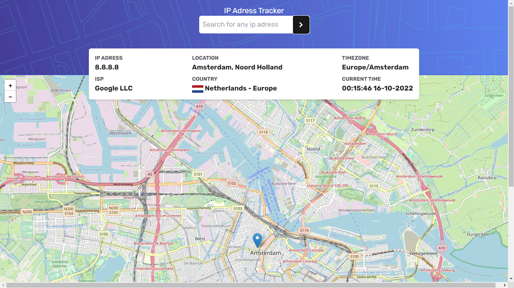

# Frontend Mentor - IP address tracker solution

This is a solution to the [IP address tracker challenge on Frontend Mentor](https://www.frontendmentor.io/challenges/ip-address-tracker-I8-0yYAH0). Frontend Mentor challenges help you improve your coding skills by building realistic projects.

## Table of contents

- [Overview](#overview)
  - [The challenge](#the-challenge)
  - [Screenshot](#screenshot)
  - [Links](#links)
- [My process](#my-process)
  - [Built with](#built-with)
  - [What I learned](#what-i-learned)
  - [Continued development](#continued-development)
  - [Useful resources](#useful-resources)
- [Author](#author)
- [Acknowledgments](#acknowledgments)

**Note: Delete this note and update the table of contents based on what sections you keep.**

## Overview

### The challenge

Users should be able to:

- View the optimal layout for each page depending on their device's screen size
- See hover states for all interactive elements on the page
- See their own IP address on the map on the initial page load
- Search for any IP addresses and see the key information and location

### Screenshot



### Links

- Solution URL: [Frontend Mentor Solution](https://www.frontendmentor.io/solutions/ip-tracker-built-with-ipdata-api-and-leaftlet-WCtTRG7FzG)
- Live Site URL: [Netlify](https://ip-tracker-rm.netlify.app) - ⚠ You may have to disable your adblocker. In order for the api to work correctly!

## My process

### Built with

- IPData API
- leaftlet
- React-Leaftlet
- Date-fns
- TailwindCSS
- React
- Vite
- [Ip data](https://ipdata.co/) - IP Geolocation
- [React](https://reactjs.org/) - JS library
- [tailwind](https://tailwindcss.com/) - CSS classes
- [React-leaflet](https://react-leaflet.js.org/) - React components for Leaflet maps

### What I learned

To use React-Leaflet, a component to create Leaflet maps and use 'fly to' events with a smooth animation.
Also learned to use date-fns to format current time of a timezone given from api.

```formated date
import { useEffect, useState } from "react";
import { formatInTimeZone } from "date-fns-tz";

function FormatDate({ date, timezoneName }) {
  console.log(date, timezoneName);
  const [time, setTime] = useState("");
  const [seconds, setSeconds] = useState(0);
  useEffect(() => {
    update();
    const newDate = new Date();
    const tempo = formatInTimeZone(
      newDate,
      timezoneName,
      "HH:mm:ss dd-MM-yyyy"
    );
    setTime(tempo);
  }, [seconds]);
  const update = () => setInterval(() => setSeconds((prev) => prev + 1), 1000);

  return <div className="text-lg text-zinc-900 font-bold">{time}</div>;
}
export { FormatDate };
```

If you want more help with writing markdown, we'd recommend checking out [The Markdown Guide](https://www.markdownguide.org/) to learn more.

### Continued development

Read more documentation to be independent from youtube tutorials.

### Useful resources

- [Tutorial from youtube](https://www.youtube.com/watch?v=62Y8SFi2wBk) - help me to use react-leaftlet.
- [Date-fns-tz](https://www.npmjs.com/package/date-fns-tz) - This package helped me to format from timezone.

## Author

- Website - [Raphael Machado](https://rm0909portfolio.netlify.app/)
- Frontend Mentor - [@rm0909](https://www.frontendmentor.io/profile/rm0909)
- Twitter - [@github](https://github.com/rm0909)
